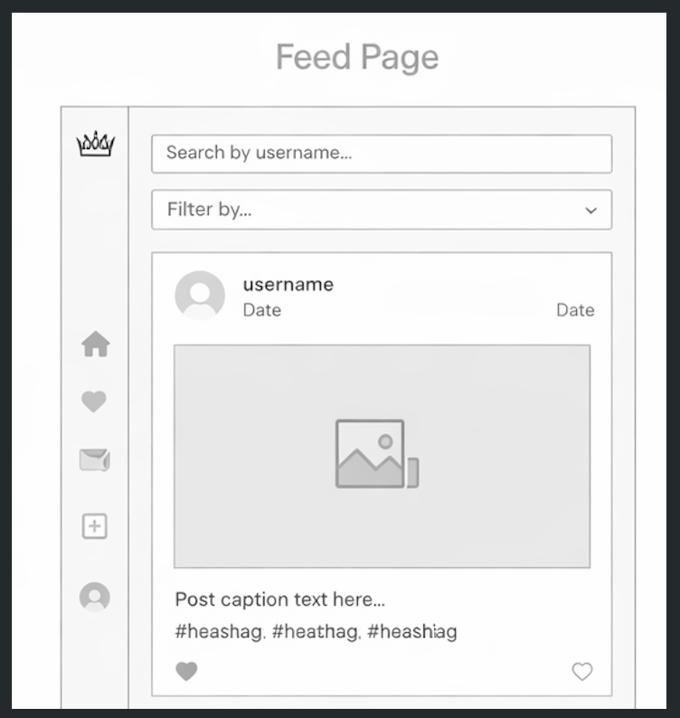
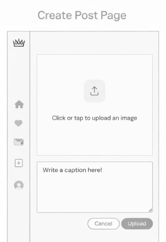
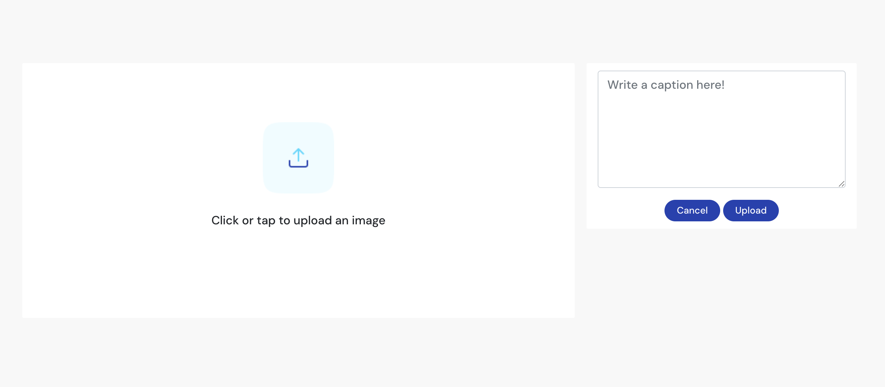
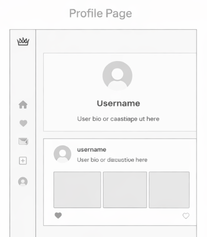
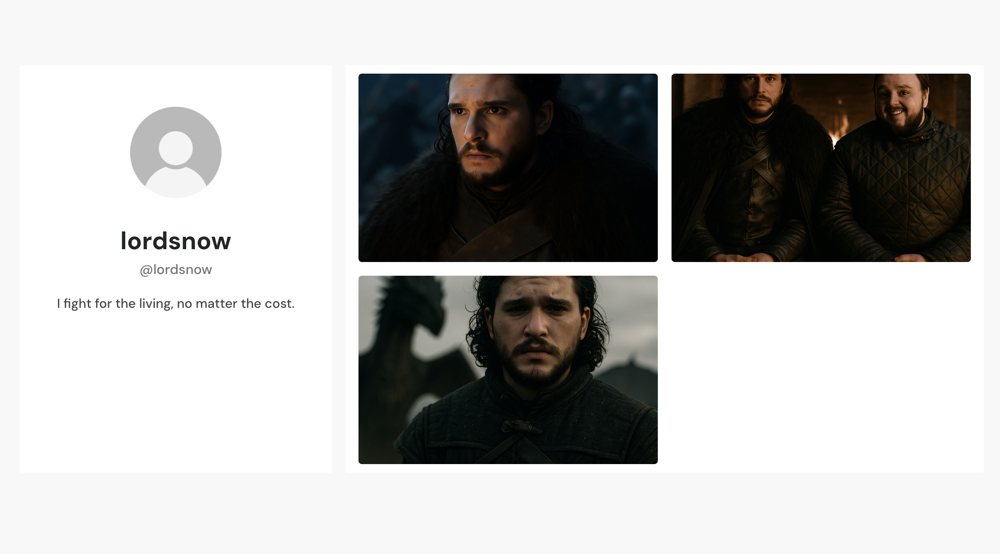
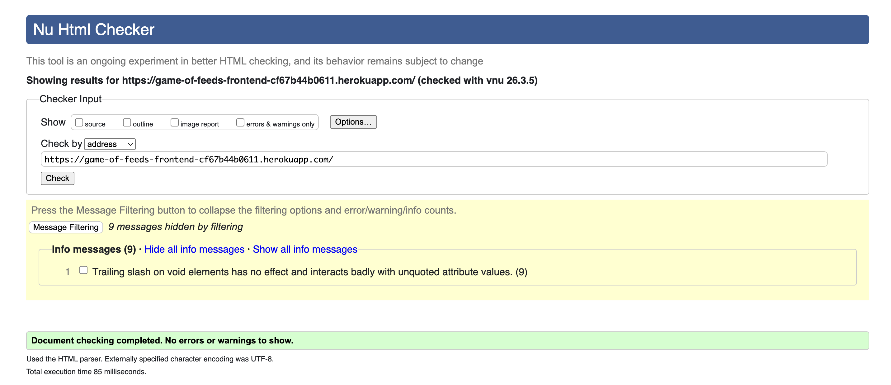
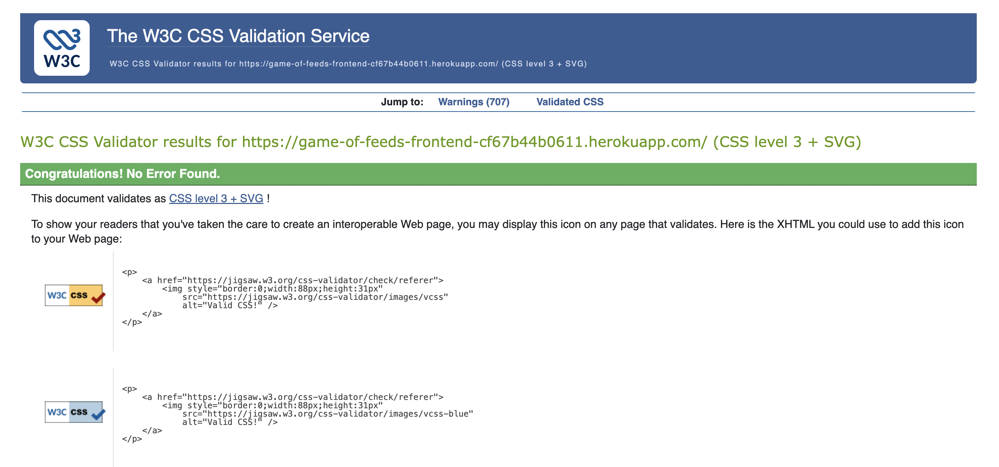

# Game of Feeds


[**Link to the live website**](https://game-of-feeds-frontend-cf67b44b0611.herokuapp.com/)


# Project Overview

Game of Feeds is a social media web application inspired by the popular television series Game of Thrones. The platform imagines a world where the characters from Westeros exist in a modern environment and share their thoughts, experiences, and humour through social media posts.

Each character has their own profile where they can upload images, write captions, and interact with posts through likes. The goal of the platform is not to simulate a realistic social network, but rather to present a humorous twist on how these iconic characters might behave if they were influencers in a modern digital world.

The application allows users to create posts, browse a feed of content, explore character profiles, and interact with posts through likes. By combining a React frontend with a Django REST API backend, the project demonstrates how a modern full-stack application can be built using component-based design and RESTful architecture.

## Features

### Homepage




**Design Rationale:**
The homepage serves as the main content feed where users can browse posts shared by the various Game of Thrones characters.

The design prioritises simplicity and usability. Posts are displayed in a structured grid layout, allowing users to browse content quickly and efficiently. Each post displays the character’s username, image, caption, and date, creating a familiar and intuitive social media experience.
A search bar allows users to quickly locate specific characters by username, while a filter option allows the feed to be organised based on different criteria. These features improve usability and allow users to navigate large amounts of content efficiently.

### Create Post




**Design Rationale:**
The create post page allows users to upload an image and write a caption for their post.

The interface was designed to be minimal and straightforward. Users simply upload an image and write a caption before publishing the post. The layout ensures that users can clearly see the image upload area and caption field without unnecessary distractions.

This design reflects the project’s goal of creating a simple and accessible posting experience, similar to other popular social media platforms.

### Profile Page




**Design Rationale:**
Each character has their own profile page where users can view their information and posts.

The profile section includes:
- Profile image
- Username
- Bio
- A grid of posts created by that character

The posts are displayed in a miniature grid layout, allowing users to quickly browse the character’s content. This layout mimics common social media profile structures while keeping the design simple and visually clean.


## Key Features


- **Character Profiles**  
  - Each Game of Thrones character has their own social media profile where they can share posts and a short bio. This creates the impression that each character is participating in the platform as an influencer.

- **Post Creation**  
  - Users can upload images and add captions to create posts. This functionality demonstrates full CRUD operations between the frontend and backend.

- **Like System**  
  - Users can interact with posts by liking them. This feature allows engagement with content and reflects common social media interaction patterns.

- **Search Functionality**  
  - A search bar allows users to find characters quickly by typing their username.

- **Filtering System**  
  - Posts can be filtered to display specific content types, helping users explore the platform more efficiently.


## Feature Implementation Details

- **Posts (Full CRUD)**  
  Users can create, edit, and delete posts. Each post is linked to a user profile and includes an image, caption, and timestamp. The frontend communicates with the Django REST API using Axios, ensuring updates are reflected instantly in the UI.

- **Comments (Full CRUD)**  
  Users can add, edit, and delete their own comments on posts. Ownership checks are handled in the backend serializer and enforced in the frontend UI.

- **Likes System**  
  Likes are stored in a separate model linking users to posts. This allows users to like and unlike posts, with real-time updates reflected in the interface.

- **Followers System**  
  Users can follow and unfollow other profiles. This relationship is managed through a dedicated model to support scalable social interactions.

- **Profile Editing**  
  Users can update their profile image, bio, and house. Image uploads are handled via Cloudinary, while text-based updates are processed through JSON API requests.


## Custom Feature: House System

A custom House model was introduced to extend the functionality beyond the original project walkthrough.

Users can select a house (e.g. Stark, Lannister), which is displayed on their profile. This is implemented using a ForeignKey relationship from the Profile model to the House model.

To safely introduce this feature:
- a new House model was created
- a multi-step migration was implemented to convert existing data
- an API endpoint (`/houses/`) was added to provide selectable options
- the frontend was updated to allow users to choose a house via a dropdown menu

This feature enhances user identity and reinforces the Game of Thrones theme.


## Design Improvements

The application UI was redesigned to improve usability and visual consistency.

- Posts are displayed in a 3x3 grid layout to create a modern social media experience
- Card-based components are used across the application for consistency
- Profile actions (edit bio, image, and house) were moved into a dropdown menu to reduce clutter
- A consistent colour scheme was applied across all pages

These improvements make the application more intuitive and visually engaging.


## Bugs & Fixes

Several technical issues were identified and resolved during development:

- **Cloudinary broken images**  
  Incorrect public IDs caused images to return 404 errors. Fixed by correcting stored values and enforcing valid URLs.

- **Mixed content issue (HTTP vs HTTPS)**  
  Image URLs were being returned as HTTP, causing browser blocking. Fixed by enforcing HTTPS in backend configuration.

- **Profile image not updating in navbar**  
  The current user context was not refreshing after updates. Fixed by syncing state after profile updates.

- **Bio updates failing**  
  PATCH requests with JSON were not being parsed correctly. Fixed by adding JSONParser to the backend view.

- **Database migration failure (house field)**  
  Converting from CharField to ForeignKey caused integrity errors. Fixed using a safe multi-step migration approach.


  # User Experience

## Strategy Plane

The Game of Feeds platform was designed to be simple, humorous, and easy to navigate. Instead of replicating the complexity of large social media platforms, the application focuses on a lightweight experience where users can quickly browse posts and interact with characters from the Game of Thrones universe.

The interface intentionally avoids unnecessary complexity so that users can immediately understand how the platform works. Users can easily create posts, view profiles, and engage with content without needing extensive instructions.

The project combines entertainment with technical demonstration, showcasing how a full-stack application can be used to deliver a playful and engaging digital experience.


### Project Goals

The primary goal of Game of Feeds was to create a fun and creative platform that reimagines how Game of Thrones characters might behave in a modern social media environment.

Rather than presenting the characters in their traditional medieval setting, the project gives them a humorous modern voice. Characters such as Jon Snow, Daenerys Targaryen, and others are portrayed as influencers sharing dramatic or sarcastic captions alongside their images.

From a development perspective, the project also aims to demonstrate the ability to build a full-stack application using React and Django REST Framework, implementing authentication, CRUD functionality, and dynamic API data consumption.


#### Problems We Are Trying to Solve

Although the project is primarily comedic, it explores an interesting creative question:

What would happen if characters from fictional universes existed in modern social media culture?

The platform provides a playful answer by allowing characters to express themselves through captions and posts that reflect their personalities. This concept could also be used as a marketing strategy in entertainment media, where fictional characters interact with audiences through digital platforms.


#### Business Model

While Game of Feeds is a demonstration project, the concept could potentially be expanded into an interactive marketing platform for entertainment franchises.

Studios could use similar platforms to promote movies, television series, or games by allowing audiences to interact with fictional characters through simulated social media profiles.


## Data and Security Features

The project includes several measures to ensure secure data handling.

Sensitive configuration values such as the Django secret key and Cloudinary credentials are stored as environment variables rather than being exposed directly in the codebase.

The Django authentication system is used to securely manage user accounts and sessions. Passwords are hashed automatically and authentication tokens are required for protected API requests.

Cross-site request forgery protection is enabled for form submissions, ensuring that malicious external requests cannot compromise user data.

In production, debug mode is disabled and allowed hosts are restricted to the deployed domain.


### User Stories

#### As a First Time Visitor, I want to:
As a new user I want to browse posts so that I can see content from Game of Thrones characters.

As a new user I want to view character profiles so that I can explore their posts and bios.

As a new user I want to search for specific characters so that I can quickly find my favourite ones.

#### As a Returning Visitor, I want to:
As a returning user I want to create posts so that I can contribute new content to the platform.

As a returning user I want to like posts so that I can interact with content I enjoy.

As a returning user I want to view my profile so that I can see the posts I have created.

#### As a Superuser, I want to:
As an administrator I want to manage users and posts so that inappropriate content can be removed.

As an administrator I want to monitor database content to ensure the platform runs correctly.


### Imagery

- All images used in the Game of Feeds project were generated using AI image generation tools to represent characters from the Game of Thrones universe in a modern social media context.

## Languages Used

- HTML
- CSS
- JavaScript
- Python

## Frameworks Used

React – Frontend application framework used to build the user interface.

Django – Backend web framework used to manage the API and database.

Django REST Framework – Used to create the RESTful API consumed by the React frontend.

Bootstrap – Used for styling and responsive layout components.

## Databases Used

SQLite – Used during development.

PostgreSQL – Used in production through Heroku.

## Libraries and Packages Used

Django REST Framework
Cloudinary
Gunicorn
Pillow
Psycopg2

React libraries including:

Axios
React Router
Bootstrap React Components


## Programmes and Applications Used

Git
GitHub
VS Code
Chrome DevTools

## Cloud Application Platforms Used

Heroku – Used to host both the Django API and React application.

Cloudinary – Used to store and serve uploaded images.

## Database Structure

The application uses a relational database structure to manage user interactions:

- A **Profile** is linked to a Django User model and stores additional user information
- A **Post** is linked to a Profile and contains image-based content
- A **Comment** is linked to both a Post and a Profile
- A **Like** connects a user to a post to track engagement
- A **Follower** model manages relationships between profiles
- A **House** model is linked to Profile via a ForeignKey to support custom user identity

This structure ensures scalable and efficient handling of social interactions.


## Deployment

Game of Feeds is a full-stack application consisting of a Django REST API backend and a React frontend. Both are deployed separately on Heroku.

---

### Backend Deployment (Django API)

#### Local Setup

1. **Clone the backend repository:**
    ```bash
    git clone https://github.com/BryanGon13/game-of-feeds-backend
    ```

2. **Create and activate a virtual environment:**
    ```bash
    python3 -m venv venv
    source venv/bin/activate
    ```

3. **Install dependencies:**
    ```bash
    pip install -r requirements.txt
    ```

4. **Create a `.env` file in the project root (do not commit this file) with the following variables:**
    ```
    SECRET_KEY=<your-secret-key>
    DATABASE_URL=sqlite:///db.sqlite3
    CLOUDINARY_URL=<your-cloudinary-url>
    DEBUG=True
    ```

5. **Run migrations:**
    ```bash
    python manage.py migrate
    ```

6. **Start the server:**
    ```bash
    python manage.py runserver
    ```
    Visit [http://127.0.0.1:8000](http://127.0.0.1:8000) to access the API locally.

#### Heroku Deployment

1. **Prerequisites:**
    - A [Heroku](https://www.heroku.com/) account.
    - A [Cloudinary](https://cloudinary.com/) account for image hosting.
    - Git and [Heroku CLI](https://devcenter.heroku.com/articles/heroku-cli) installed locally.

2. **Prepare your project for deployment:**
    Ensure the following files exist in your repository:
    - `requirements.txt` – installable dependencies:
      ```bash
      pip freeze > requirements.txt
      ```
    - `runtime.txt` – Python version (e.g.):
      ```
      python-3.12.2
      ```
    - `Procfile` – tells Heroku how to run the app:
      ```
      web: gunicorn game_of_feeds_backend.wsgi
      ```
    - Required dependencies:
      ```
      django-heroku
      dj-database-url
      gunicorn
      psycopg2
      cloudinary
      ```

3. **Push your code to GitHub** (Heroku will deploy from there).

4. **Create the Heroku app:**
    ```bash
    heroku login
    heroku create your-api-name
    ```

5. **Add Heroku Postgres:**
    ```bash
    heroku addons:create heroku-postgresql:hobby-dev
    ```

6. **Set environment variables in Heroku:**
    In the Heroku dashboard go to **Settings → Reveal Config Vars** and add:
    ```
    SECRET_KEY=<your-secret-key>
    DATABASE_URL=<provided by Heroku Postgres>
    CLOUDINARY_URL=<your-cloudinary-url>
    DEBUG=False
    ALLOWED_HOSTS=your-api-name.herokuapp.com
    CLIENT_ORIGIN=https://your-frontend-name.herokuapp.com
    ```

7. **Deploy to Heroku:**
    ```bash
    git push heroku main
    ```

8. **Run migrations on Heroku:**
    ```bash
    heroku run python manage.py migrate
    ```

9. **(Optional) Create a superuser:**
    ```bash
    heroku run python manage.py createsuperuser
    ```

---

### Frontend Deployment (React)

#### Local Setup

1. **Clone the frontend repository:**
    ```bash
    git clone https://github.com/BryanGon13/game-of-feeds-frontend
    ```

2. **Install dependencies:**
    ```bash
    npm install
    ```

3. **Create a `.env` file in the project root (do not commit this file) with the following variable:**
    ```
    REACT_APP_API_URL=http://127.0.0.1:8000
    ```
    This tells the React app where to send API requests. In development this points to the local Django server.

4. **Start the development server:**
    ```bash
    npm start
    ```
    Visit [http://localhost:3000](http://localhost:3000) to view the app locally.

#### Heroku Deployment

The React app is built into a set of static files and served via Heroku.

1. **Prerequisites:**
    - A [Heroku](https://www.heroku.com/) account.
    - Git and [Heroku CLI](https://devcenter.heroku.com/articles/heroku-cli) installed locally.
    - The backend API must already be deployed and accessible.

2. **Create the Heroku app:**
    ```bash
    heroku login
    heroku create your-frontend-name
    ```

3. **Add the Node.js buildpack:**
    ```bash
    heroku buildpacks:set heroku/nodejs
    ```

4. **Set the environment variable in Heroku:**
    In the Heroku dashboard go to **Settings → Reveal Config Vars** and add:
    ```
    REACT_APP_API_URL=https://your-api-name.herokuapp.com
    ```
    This connects the deployed React app to the live Django API.

5. **Build and deploy:**
    Heroku automatically runs `npm run build` on deployment, which compiles the React app into optimised static files for production.
    ```bash
    git push heroku main
    ```

6. **Open your live app:**
    ```bash
    heroku open
    ```
    Or visit:
    ```
    https://your-frontend-name.herokuapp.com/
    ```

## Features Left to Implement

Private messaging between users

Support for video uploads

Improved profile customisation 

## Accessibility Statement

The platform was designed with accessibility considerations including sufficient colour contrast, keyboard navigability, and descriptive alt text for images to support screen readers.


## Testing

### Code Validation

To ensure code quality and best practices, the following validation tools were used:

- **HTML** — All HTML templates were tested using the [W3C Markup Validation Service](https://validator.w3.org/).  


- **CSS** — All custom CSS was tested with the [W3C CSS Validator](https://jigsaw.w3.org/css-validator/).  



All validation tools reported no critical errors. 

---

### Manual Testing

| Feature | Test | Expected Result | Actual Result |
|--------|------|-----------------|---------------|
| Feed loading | Open homepage | Feed loads correctly with posts | Pass |
| Create post | Upload image + caption | Post is created and displayed | Pass |
| Edit post | Modify caption/image | Post updates correctly | Pass |
| Delete post | Remove post | Post is removed from feed | Pass |
| Comments | Create, edit, delete | Comments behave correctly | Pass |
| Profile | Update bio, image, house | Profile updates correctly | Pass |
| Likes | Like/unlike post | Like count updates correctly | Pass |
| Search | Search username | Matching profiles appear | Pass |

### Validation Testing

- Empty forms are prevented from submission
- Post creation requires an image
- Caption fields cannot be submitted empty
- Sign-in and sign-up forms disable submission when incomplete
- Errors are displayed clearly to the user


### Backend Manual Testing

The backend API was tested manually using the browser, the Django REST Framework browsable API, and live frontend interactions to confirm that requests were processed correctly and that database records were created, updated, and deleted as expected.

| Endpoint / Feature | Test Performed | Expected Result | Result |
|--------------------|----------------|-----------------|--------|
| `/posts/` | Create a new post with image and caption | New post is saved and returned by the API | Pass |
| `/posts/<id>/` | Edit an existing post as owner | Updated post data is saved correctly | Pass |
| `/posts/<id>/` | Delete a post as owner | Post is removed from the database | Pass |
| `/comments/` | Create a comment linked to a post | Comment is saved and linked correctly | Pass |
| `/comments/<id>/` | Edit comment as owner | Updated comment content is returned | Pass |
| `/comments/<id>/` | Delete comment as owner | Comment is removed successfully | Pass |
| `/likes/` | Like a post | Like record is created and linked to the post | Pass |
| `/likes/<id>/` | Unlike a post | Like record is deleted successfully | Pass |
| `/followers/` | Follow another profile | Follower relationship is created correctly | Pass |
| `/followers/<id>/` | Unfollow a profile | Follower relationship is removed correctly | Pass |
| `/profiles/<id>/` | Update bio using PATCH request | Bio is updated and returned correctly | Pass |
| `/profiles/<id>/` | Update profile image | Image is uploaded to Cloudinary and saved correctly | Pass |
| `/profiles/<id>/` | Update selected house | House relationship is saved correctly | Pass |
| `/houses/` | Retrieve available houses | House list is returned correctly | Pass |
| Authentication | Register a user | New user and profile are created successfully | Pass |
| Authentication | Log in with valid credentials | Access/refresh tokens are returned successfully | Pass |
| Permissions | Attempt to edit another user’s content | Request is denied with the correct permission response | Pass |

### Backend Validation and Permission Testing

Additional backend checks were carried out to confirm that serializers, permissions, and request handling worked correctly:

- Blank or invalid submissions were rejected by serializers where appropriate
- Only authenticated users were able to create protected content
- Only owners were able to edit or delete their own posts and comments
- Profile updates were restricted to the profile owner
- Legacy profile image issues were tested and corrected through database and serializer fixes
- House data was tested after migration to confirm valid ForeignKey relationships

---

### Responsiveness Testing

The application was tested using Chrome DevTools device simulation and on multiple screen sizes to ensure responsiveness across desktop, tablet, and mobile devices.

---

### Known Issues

On some profile pages the miniature preview images may appear slightly misaligned. This occurs when the image focal point differs from the cropped grid layout.


## Credits & Acknowledgements

- **Code Institute:**  
  For providing the course structure, lessons, and guidance that formed the foundation for building this project.  

- **Code Institute Slack Community:**  
  For their quick responses, valuable insights, and helpful feedback throughout the development process.  

- **Documentation & Tutorials:**  
  Django and Bootstrap official documentation, Cloudinary integration guides, and various React tutorials were referenced to ensure best practices in coding and deployment.   

- **Personal Support:**  
  Special thanks to my cousin, **Jose Omar Gonzalez**, a full stack developer, who was with me every step of the way, providing guidance, support, and technical expertise.  
